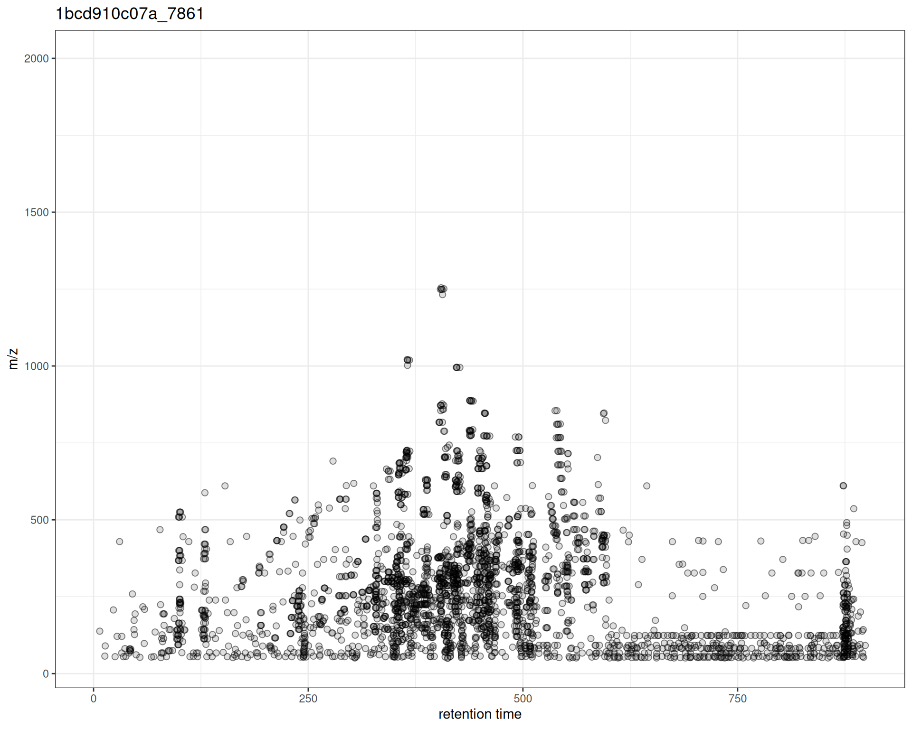
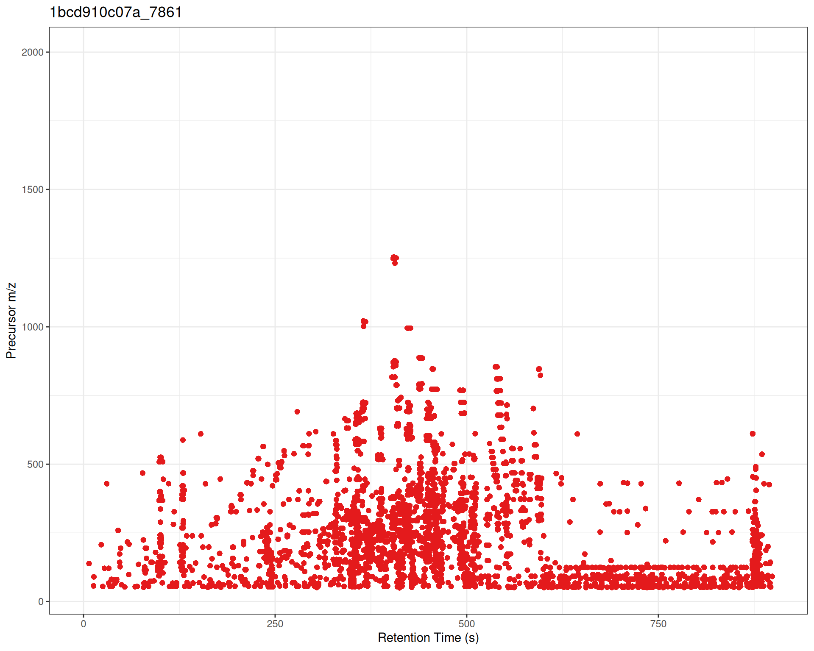
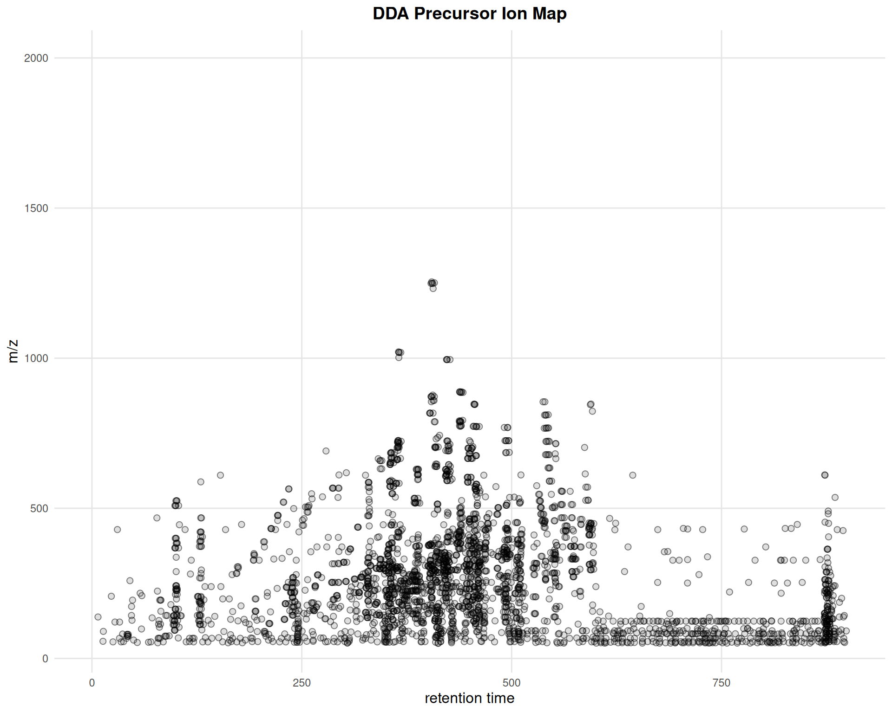

# Step 1: Raw Data Visualization

## Introduction

This vignette covers the **first step** in the
*[xcms](https://bioconductor.org/packages/3.23/xcms)* metabolomics data
analysis workflow: **visualizing raw MS data** before any processing.
These visualizations help you:

- Assess data quality before analysis
- Understand the structure of your LC-MS acquisition
- Identify potential issues early
- Visualize MS/MS (DDA) experiment coverage

### *xcms* Workflow Context

    ┌───────────────────────────────┐
    │ 1. RAW DATA VISUALIZATION     | ← YOU ARE HERE
    ├────────────────────────────-──┤
    │ 2. Peak Detection             │
    │ 3. Peak Correspondence        │
    │ 4. Retention Time Alignment   │
    │ 5. Feature Grouping           │
    └──────────────────────────----─┘

### Functions Covered

| Function | Purpose | Input Type |
|----|----|----|
| `gplot(XcmsExperiment)` | Visualize full MS data | `XcmsExperiment`, `XCMSnExp` |
| [`gplotPrecursorIons()`](https://stanstrup.github.io/xcmsVis/reference/gplotPrecursorIons.md) | Visualize MS/MS precursors | `MsExperiment` with MS2 |

## Setup

``` r

library(xcms)
library(xcmsVis)
library(MsExperiment)
library(ggplot2)
library(plotly)
library(patchwork)
library(MsDataHub)
```

## Part 1: Full MS Data Visualization

### Overview

The [`gplot()`](https://stanstrup.github.io/xcmsVis/reference/gplot.md)
method for `XcmsExperiment` and `XCMSnExp` objects creates a two-panel
visualization:

- **Upper panel**: Base Peak Intensity (BPI) chromatogram vs retention
  time
- **Lower panel**: m/z vs retention time scatter plot

Both panels use intensity-based coloring, and detected peaks (if any)
are automatically overlaid as rectangles.

### Data Preparation

We’ll use pre-processed test data from *xcms*:

``` r

# Load pre-processed data
xdata <- loadXcmsData("faahko_sub2")

# Check data
cat("Samples:", length(xdata), "\n")
#> Samples: 3
cat("Total peaks detected:", nrow(chromPeaks(xdata)), "\n")
#> Total peaks detected: 248
```

For visualization, we’ll filter to a specific retention time and m/z
region:

``` r

# Filter to focused region
mse <- filterRt(xdata, rt = c(2785-100, 2785+100))
mse <- filterMzRange(mse, mz = c(278, 283))
```

### Basic Usage

#### Single Sample Visualization

``` r

gplot(mse[1])
```


#### Understanding the Two Panels

##### Upper Panel: BPI Chromatogram

The **Base Peak Intensity (BPI)** shows the maximum intensity at each
retention time across all m/z values in the filtered range.

- Each point represents one retention time
- Y-axis shows the maximum intensity observed at that time
- Color indicates intensity magnitude
- Useful for identifying retention time regions with strong signals

##### Lower Panel: m/z vs RT Scatter

The **m/z vs retention time scatter** shows the complete mass spectral
data:

- X-axis: retention time
- Y-axis: m/z values
- Each point represents one data point (mass peak) from the raw spectra
- Color indicates intensity of that specific m/z at that retention time
- Shows the full two-dimensional structure of the LC-MS data

##### Peak Overlays

If chromatographic peaks have been detected (via
[`findChromPeaks()`](https://rdrr.io/pkg/xcms/man/findChromPeaks.html)),
they are automatically overlaid as rectangles showing:

- Peak retention time boundaries (left/right edges)
- Peak m/z boundaries (top/bottom edges)
- Semi-transparent red color by default

### Multiple Samples

When visualizing multiple samples,
[`gplot()`](https://stanstrup.github.io/xcmsVis/reference/gplot.md)
creates a vertically stacked layout:

``` r

# Plot all three samples
gplot(mse)
```


### Customization

#### Custom Colors

``` r

gplot(mse[1],
      col = "blue",           # Point border color
      peakCol = "red")        # Peak rectangle color
```


#### Custom Color Ramps

The intensity coloring uses a color ramp function. The viridis scales
are reversed to follow MS convention (low=dark, high=bright):

``` r

library(viridisLite)

# Create reversed versions for MS convention (low=dark, high=bright)
viridis_rev <- function(n) rev(viridis(n))
magma_rev <- function(n) rev(magma(n))
plasma_rev <- function(n) rev(plasma(n))

p1 <- gplot(mse[1], colramp = viridis_rev) + ggtitle("Viridis")
p2 <- gplot(mse[1], colramp = magma_rev) + ggtitle("Magma")
p3 <- gplot(mse[1], colramp = plasma_rev) + ggtitle("Plasma")

(p1 | p2 | p3)
```


#### Custom Titles

``` r

# Plot shows sample names from data automatically
gplot(mse)
```


### Interactive Visualization

Convert to interactive plotly for data exploration:

``` r

p <- gplot(mse[1])
ggplotly(p)
```

**Accessing Individual Panels:**

Since
[`gplot()`](https://stanstrup.github.io/xcmsVis/reference/gplot.md)
returns a patchwork object combining two panels, you can access and make
each panel interactive separately:

``` r

# Upper panel (BPI chromatogram)
ggplotly(p[[1]])

# Lower panel (m/z vs RT scatter)
ggplotly(p[[2]])
```

This is useful when you want to customize each panel independently or
embed them separately in reports.

## Part 2: MS/MS Precursor Ion Visualization

### Overview

The
[`gplotPrecursorIons()`](https://stanstrup.github.io/xcmsVis/reference/gplotPrecursorIons.md)
function visualizes precursor ions selected for fragmentation in MS/MS
(tandem mass spectrometry) experiments. This is particularly useful for:

- Assessing DDA (Data-Dependent Acquisition) performance
- Visualizing MS/MS coverage across the chromatographic run
- Quality control of MS/MS experiments
- Understanding which compounds were fragmented

### What are Precursor Ions?

In MS/MS experiments, the mass spectrometer:

1.  Performs MS1 scans to detect all ions
2.  Selects specific ions (precursors) based on criteria (intensity,
    exclusion lists, etc.)
3.  Fragments these precursors and records MS2 spectra

The
[`gplotPrecursorIons()`](https://stanstrup.github.io/xcmsVis/reference/gplotPrecursorIons.md)
function plots where and which precursor ions were selected across the
LC-MS run.

### Loading DDA Data

We’ll use example DDA data from the *MsDataHub* package:

``` r

# Load DDA MS/MS data
fl <- MsDataHub::PestMix1_DDA.mzML()

pest_dda <- readMsExperiment(fl)

# Check data structure
pest_dda
#> Object of class MsExperiment 
#>  Spectra: MS1 (4627) MS2 (2975) 
#>  Experiment data: 1 sample(s)
#>  Sample data links:
#>   - spectra: 1 sample(s) to 7602 element(s).
```

### Basic Precursor Ion Visualization

#### Default Plot

``` r

p <- gplotPrecursorIons(pest_dda)
p
```



The plot shows:

- **X-axis**: Retention time when MS2 spectrum was acquired
- **Y-axis**: m/z of the precursor ion selected for fragmentation
- **Points**: Each precursor ion

#### Interpretation

From this plot, you can see:

- **Distribution of MS/MS events** across the chromatographic run
- **m/z range** of fragmented ions
- **Density patterns** - where fragmentation was most active
- **Coverage gaps** - RT or m/z regions without MS/MS data

### Customization

#### Custom Colors and Symbols

``` r

p_custom <- gplotPrecursorIons(
  pest_dda,
  pch = 16,                    # filled circle
  col = "#E41A1C"              # point color
) +
  labs(
    x = "Retention Time (s)",
    y = "Precursor m/z"
  )

p_custom
```



#### Adding ggplot2 Layers

``` r

gplotPrecursorIons(pest_dda) +
  ggtitle("DDA Precursor Ion Map") +
  theme_minimal() +
  theme(
    plot.title = element_text(hjust = 0.5, face = "bold", size = 14),
    axis.title = element_text(size = 12),
    panel.grid.major = element_line(color = "gray90"),
    panel.grid.minor = element_blank()
  )
```



### Interactive Precursor Visualization

``` r

p_interactive <- gplotPrecursorIons(pest_dda)
ggplotly(p_interactive)
```

## Summary

### When to Use

- **Before any processing**: Assess raw data quality
- **Method development**: Evaluate acquisition parameters
- **Quality control**: Ensure expected coverage and signals
- **DDA experiments**: Verify MS/MS performance

### Next Steps

After visualizing and assessing your raw data, proceed to:

→ **[Step 2: Peak
Detection](https://stanstrup.github.io/xcmsVis/articles/step2-peak-detection.md)** -
Detect chromatographic peaks in your data

## Comparison with Original *xcms*

### gplot(XcmsExperiment) vs plot()

#### Original *xcms*

``` r

plot(mse[1])
```


#### *xcmsVis* ggplot2

``` r

gplot(mse[1])
```


### gplotPrecursorIons() vs plotPrecursorIons()

#### Original *xcms*

``` r

plotPrecursorIons(pest_dda)
```


#### *xcmsVis* ggplot2

``` r

gplotPrecursorIons(pest_dda)
```


## Session Info

``` r

sessionInfo()
#> R version 4.6.0 (2026-04-24)
#> Platform: x86_64-pc-linux-gnu
#> Running under: Ubuntu 24.04.4 LTS
#> 
#> Matrix products: default
#> BLAS:   /usr/lib/x86_64-linux-gnu/openblas-pthread/libblas.so.3 
#> LAPACK: /usr/lib/x86_64-linux-gnu/openblas-pthread/libopenblasp-r0.3.26.so;  LAPACK version 3.12.0
#> 
#> locale:
#>  [1] LC_CTYPE=C.UTF-8       LC_NUMERIC=C           LC_TIME=C.UTF-8       
#>  [4] LC_COLLATE=C.UTF-8     LC_MONETARY=C.UTF-8    LC_MESSAGES=C.UTF-8   
#>  [7] LC_PAPER=C.UTF-8       LC_NAME=C              LC_ADDRESS=C          
#> [10] LC_TELEPHONE=C         LC_MEASUREMENT=C.UTF-8 LC_IDENTIFICATION=C   
#> 
#> time zone: UTC
#> tzcode source: system (glibc)
#> 
#> attached base packages:
#> [1] stats     graphics  grDevices utils     datasets  methods   base     
#> 
#> other attached packages:
#>  [1] viridisLite_0.4.3   MsDataHub_1.12.0    patchwork_1.3.2    
#>  [4] plotly_4.12.0       ggplot2_4.0.3       MsExperiment_1.14.0
#>  [7] ProtGenerics_1.44.0 xcmsVis_0.99.11     xcms_4.10.0        
#> [10] BiocParallel_1.46.0 BiocStyle_2.40.0   
#> 
#> loaded via a namespace (and not attached):
#>   [1] RColorBrewer_1.1-3          jsonlite_2.0.0             
#>   [3] MultiAssayExperiment_1.38.0 magrittr_2.0.5             
#>   [5] farver_2.1.2                MALDIquant_1.22.3          
#>   [7] rmarkdown_2.31              fs_2.1.0                   
#>   [9] vctrs_0.7.3                 memoise_2.0.1              
#>  [11] htmltools_0.5.9             S4Arrays_1.12.0            
#>  [13] progress_1.2.3              AnnotationHub_4.2.0        
#>  [15] curl_7.1.0                  SparseArray_1.12.2         
#>  [17] mzID_1.50.0                 htmlwidgets_1.6.4          
#>  [19] plyr_1.8.9                  httr2_1.2.2                
#>  [21] impute_1.86.0               cachem_1.1.0               
#>  [23] igraph_2.3.1                lifecycle_1.0.5            
#>  [25] iterators_1.0.14            pkgconfig_2.0.3            
#>  [27] Matrix_1.7-5                R6_2.6.1                   
#>  [29] fastmap_1.2.0               MatrixGenerics_1.24.0      
#>  [31] clue_0.3-68                 digest_0.6.39              
#>  [33] pcaMethods_2.4.0            AnnotationDbi_1.74.0       
#>  [35] S4Vectors_0.50.0            ExperimentHub_3.2.0        
#>  [37] crosstalk_1.2.2             GenomicRanges_1.64.0       
#>  [39] RSQLite_2.4.6               labeling_0.4.3             
#>  [41] filelock_1.0.3              Spectra_1.22.0             
#>  [43] httr_1.4.8                  abind_1.4-8                
#>  [45] compiler_4.6.0              bit64_4.8.0                
#>  [47] withr_3.0.2                 doParallel_1.0.17          
#>  [49] S7_0.2.2                    PTMods_1.0.0               
#>  [51] DBI_1.3.0                   MASS_7.3-65                
#>  [53] rappdirs_0.3.4              DelayedArray_0.38.1        
#>  [55] mzR_2.46.0                  tools_4.6.0                
#>  [57] PSMatch_1.16.0              otel_0.2.0                 
#>  [59] glue_1.8.1                  QFeatures_1.22.0           
#>  [61] grid_4.6.0                  cluster_2.1.8.2            
#>  [63] reshape2_1.4.5              generics_0.1.4             
#>  [65] gtable_0.3.6                preprocessCore_1.74.0      
#>  [67] tidyr_1.3.2                 data.table_1.18.2.1        
#>  [69] hms_1.1.4                   MetaboCoreUtils_1.20.1     
#>  [71] XVector_0.52.0              BiocGenerics_0.58.0        
#>  [73] BiocVersion_3.23.1          foreach_1.5.2              
#>  [75] pillar_1.11.1               stringr_1.6.0              
#>  [77] limma_3.68.1                dplyr_1.2.1                
#>  [79] BiocFileCache_3.2.0         lattice_0.22-9             
#>  [81] bit_4.6.0                   tidyselect_1.2.1           
#>  [83] Biostrings_2.80.0           knitr_1.51                 
#>  [85] IRanges_2.46.0              Seqinfo_1.2.0              
#>  [87] SummarizedExperiment_1.42.0 stats4_4.6.0               
#>  [89] xfun_0.57                   Biobase_2.72.0             
#>  [91] statmod_1.5.1               MSnbase_2.37.0             
#>  [93] matrixStats_1.5.0           stringi_1.8.7              
#>  [95] lazyeval_0.2.3              yaml_2.3.12                
#>  [97] evaluate_1.0.5              codetools_0.2-20           
#>  [99] MsCoreUtils_1.24.0          tibble_3.3.1               
#> [101] BiocManager_1.30.27         cli_3.6.6                  
#> [103] affyio_1.82.0               Rcpp_1.1.1-1.1             
#> [105] MassSpecWavelet_1.78.0      dbplyr_2.5.2               
#> [107] png_0.1-9                   XML_3.99-0.23              
#> [109] parallel_4.6.0              blob_1.3.0                 
#> [111] prettyunits_1.2.0           AnnotationFilter_1.36.0    
#> [113] MsFeatures_1.20.0           scales_1.4.0               
#> [115] affy_1.90.0                 ncdf4_1.24                 
#> [117] purrr_1.2.2                 crayon_1.5.3               
#> [119] rlang_1.2.0                 vsn_3.80.0                 
#> [121] KEGGREST_1.52.0
```
