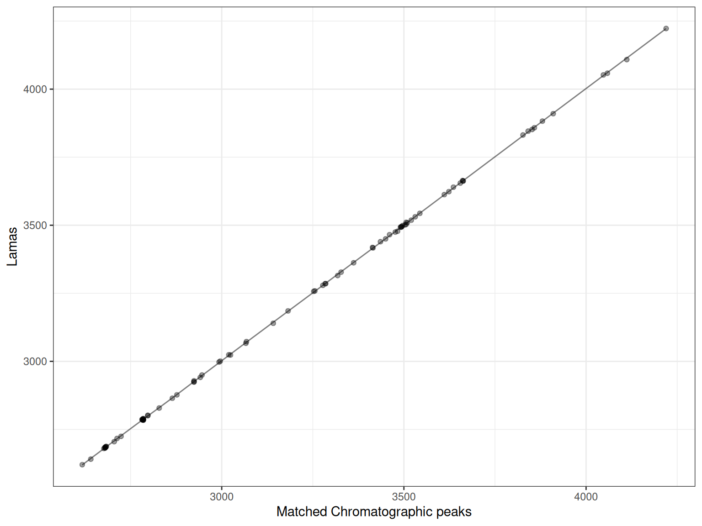
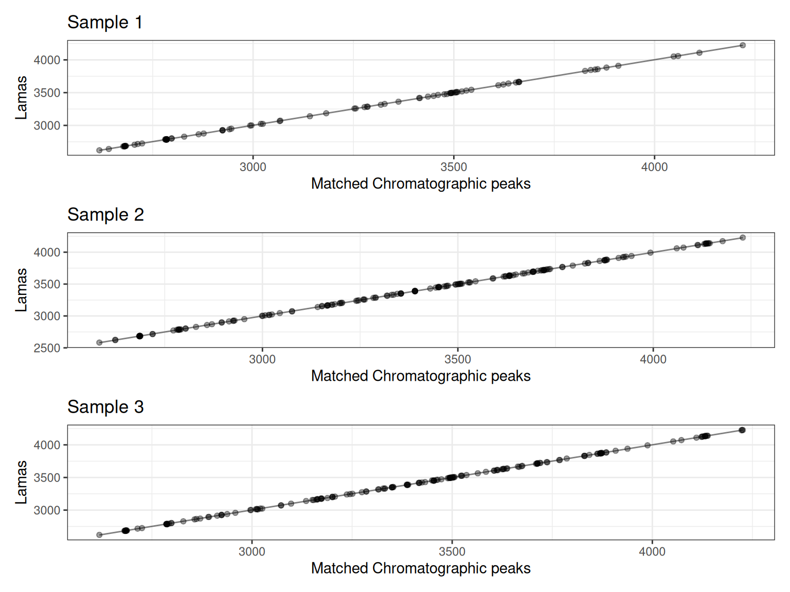
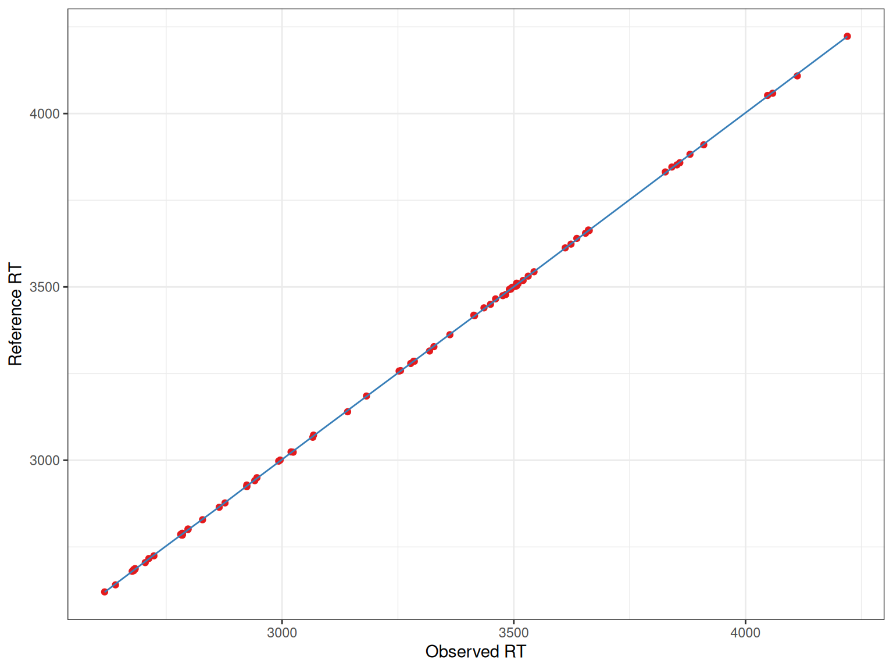
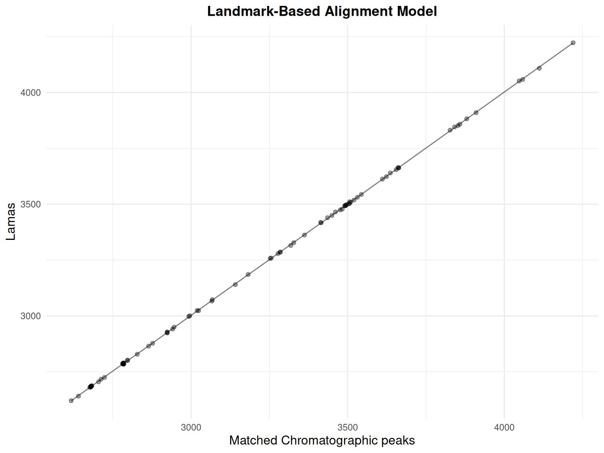
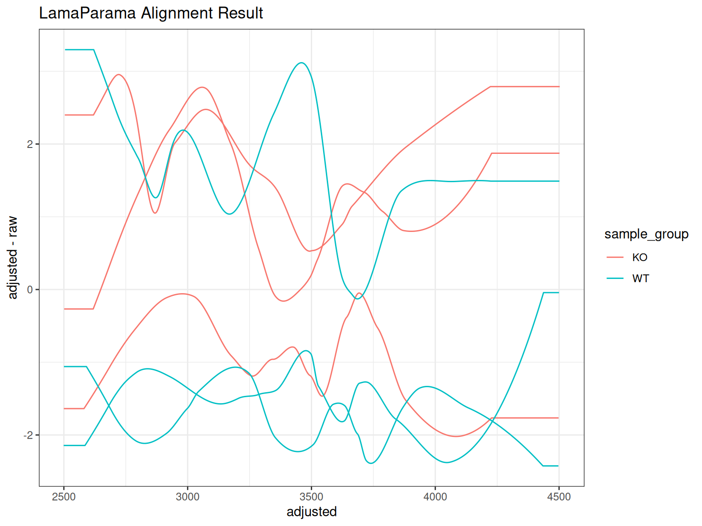

# Step 4: Retention Time Alignment Visualization

## Introduction

This vignette covers the **fourth step** in the *xcms* metabolomics
workflow: **retention time alignment**. After peak correspondence, these
functions help you:

- Visualize retention time corrections across samples
- Assess alignment quality
- Compare different alignment methods
- Examine alignment model parameters (LamaParama)

### *xcms* Workflow Context

    ┌───────────────────────────────┐
    │ 1. Raw Data Visualization     │
    │ 2. Peak Detection             │
    │ 3. Peak Correspondence        │
    ├───────────────────────────────┤
    │ 4. RT ALIGNMENT               │ ← YOU ARE HERE
    ├───────────────────────────────┤
    │ 5. Feature Grouping           │
    └───────────────────────────────┘

### What is Retention Time Alignment?

Retention time alignment (also called retention time correction) adjusts
for systematic shifts in retention time between samples. This improves
feature detection by ensuring that the same compound elutes at
consistent times across all samples.

### Functions Covered

| Function | Purpose | Input Type |
|----|----|----|
| [`gplotAdjustedRtime()`](https://stanstrup.github.io/xcmsVis/reference/gplotAdjustedRtime.md) | General RT alignment visualization | `XcmsExperiment`, `XCMSnExp` |
| `gplot(LamaParama)` | LamaParama-specific model visualization | `LamaParama` object |

## Setup

``` r

library(xcms)
library(xcmsVis)
library(ggplot2)
library(plotly)
library(faahKO)
library(MsExperiment)
library(BiocParallel)
```

## Data Preparation

We’ll use the *faahKO* package data:

``` r

# Get example CDF files
cdf_files <- dir(system.file("cdf", package = "faahKO"),
                  recursive = TRUE, full.names = TRUE)

# Using 6 samples (3 from each group)
cdf_files <- cdf_files[c(1:3, 7:9)]

# Load data as XcmsExperiment
xdata_raw <- readMsExperiment(
  spectraFiles = cdf_files,
  BPPARAM = SerialParam()
)

# Add sample metadata
sample_group <- rep(c("KO", "WT"), each = 3)
sampleData(xdata_raw)$sample_name <- basename(cdf_files)
sampleData(xdata_raw)$sample_group <- sample_group
```

### Peak Detection and Correspondence

``` r

# Peak detection
cwp <- CentWaveParam(
  peakwidth = c(20, 80),
  ppm = 25
)
xdata_peaks <- findChromPeaks(xdata_raw, param = cwp, BPPARAM = SerialParam())

# Initial correspondence (peak grouping)
sample_data <- sampleData(xdata_peaks)

pdp <- PeakDensityParam(
  sampleGroups = sample_data$sample_group,
  minFraction = 0.4,
  bw = 30
)
xdata_grouped <- groupChromPeaks(xdata_peaks, param = pdp)
```

## Part 1: General Alignment Visualization

### gplotAdjustedRtime(): PeakGroups Method

#### Basic Workflow

``` r

# Work with a copy of the grouped data
xdata <- xdata_grouped

# Retention time alignment using peak groups
pgp <- PeakGroupsParam(
  minFraction = 0.4,
  smooth = "loess",
  span = 0.2,
  family = "gaussian"
)
xdata <- adjustRtime(xdata, param = pgp)
```

#### Creating the Plot

``` r

p <- gplotAdjustedRtime(xdata, color_by = sample_group)
print(p)
```


The plot shows:

- **Lines**: One per sample, showing RT deviation across the
  chromatographic run
- **Grey circles**: Individual peaks used for alignment
- **Grey dashed lines**: Connect peaks from the same feature across
  samples

#### Customizing the Plot

``` r

p +
  labs(
    title = "Retention Time Correction - faahKO Dataset",
    x = "Adjusted Retention Time (s)",
    y = "RT Adjustment (s)",
    color = "Sample Group"
  ) +
  theme_minimal() +
  scale_color_brewer(palette = "Set1") +
  theme(legend.position = "top")
```


#### Interactive Visualization

``` r

p_interactive <- ggplotly(p, tooltip = "text")
p_interactive
```

### Advanced Use Cases

#### With filterFile()

``` r

# Work with a fresh copy from grouped data
xdata_filtered <- xdata_grouped

# Filter to specific samples (files 2-5)
xdata_filtered <- filterFile(xdata_filtered, c(2:5))

# Filtering removes correspondence - need to re-group with filtered samples
sample_data_filtered <- sampleData(xdata_filtered)
pdp_filtered <- PeakDensityParam(
  sampleGroups = sample_data_filtered$sample_group,
  minFraction = 0.4,
  bw = 30
)
xdata_filtered <- groupChromPeaks(xdata_filtered, param = pdp_filtered)

# Align filtered data
pgp_filter <- PeakGroupsParam(minFraction = 0.4)
xdata_filtered <- adjustRtime(xdata_filtered, param = pgp_filter)
```

``` r

gplotAdjustedRtime(xdata_filtered, color_by = sample_group)
```


#### With subset Parameter

You can use only specific samples for alignment calculation while
keeping all samples in the dataset:

``` r

# Work with a fresh copy of grouped data
xdata_subset <- xdata_grouped

# Use subset parameter to align using only specific samples
pgp_subset <- PeakGroupsParam(
  minFraction = 0.4,
  smooth = "loess",
  span = 0.2,
  family = "gaussian",
  subset = c(1, 2, 3, 5)  # Exclude sample 4 from alignment calculation
)
xdata_subset <- adjustRtime(xdata_subset, param = pgp_subset)
```

``` r

gplotAdjustedRtime(xdata_subset, color_by = sample_group)
```


## Part 2: LamaParama Alignment Visualization

### What is LamaParama?

LamaParama (Landmark-based Alignment Parameters) is an alignment method
in *xcms* that uses feature groups as “landmarks” to correct retention
time shifts. Unlike other methods, it explicitly models the RT
relationship and stores the alignment parameters for visualization and
quality assessment.

### Landmark-Based Alignment

`LamaParama` alignment works by using a subset of high-quality features
as “landmarks” to model retention time shifts. The key is to select
features that are reliably detected across samples.

``` r

# Work with fresh grouped data
xdata_lama <- xdata_grouped

# Filter to high-quality features present in most samples
# Using PercentMissingFilter to keep only features found in at least 80%
# of samples
library(MsFeatures)
xdata_filtered <- filterFeatures(
  xdata_lama,
  PercentMissingFilter(threshold = 20, f = sampleData(xdata_lama)$sample_group)
)

# Extract filtered feature definitions to use as landmarks
fdef_filtered <- featureDefinitions(xdata_filtered)

# Create landmark matrix (mz and rt columns) from the subset
lamas <- cbind(
  mz = fdef_filtered$mzmed,
  rt = fdef_filtered$rtmed
)

# Show how many landmarks we're using vs total features
cat("Using", nrow(lamas), "landmarks out of",
    nrow(featureDefinitions(xdata_lama)), "total features\n")
#> Using 451 landmarks out of 1600 total features

# Create LamaParama object
lama_param <- LamaParama(
  lamas = lamas,
  method = "loess",
  span = 0.4
)

# Perform alignment on the original (unfiltered) data using the landmark subset
xdata_lama <- adjustRtime(xdata_lama, param = lama_param)
```

### Visualizing LamaParama Results

#### Extract LamaParama Object

``` r

# Extract LamaParama from process history
proc_hist <- processHistory(xdata_lama,
                            type = xcms:::.PROCSTEP.RTIME.CORRECTION)
lama_result <- proc_hist[[length(proc_hist)]]@param
```

#### Basic Alignment Plot

Each plot shows:

- **Points**: Matched peaks between the sample and reference
- **Line**: The fitted retention time correction model

``` r

# Plot alignment for first sample
p <- gplot(lama_result, index = 1)
p
```



The x-axis shows the observed retention times in the sample, while the
y-axis shows the reference (or “Lama”) retention times. The fitted line
shows how retention times should be adjusted.

#### Multiple Samples

``` r

# Create plots for first 3 samples
p1 <- gplot(lama_result, index = 1) + ggtitle("Sample 1")
p2 <- gplot(lama_result, index = 2) + ggtitle("Sample 2")
p3 <- gplot(lama_result, index = 3) + ggtitle("Sample 3")

# Display plots
library(patchwork)
p1 / p2 / p3
```



The plots show how well the filtered landmark features align between
samples. Since we filtered to features present in at least 80% of
samples, these landmarks represent robust, high-quality features
suitable for modeling retention time shifts.

#### Customization

##### Custom Colors

``` r

p_custom <- gplot(lama_result,
                  index = 1,
                  colPoints = "#E41A1C",
                  colFit = "#377EB8") +
  labs(x = "Observed RT", y = "Reference RT")

p_custom
```



##### With ggplot2 Enhancements

``` r

gplot(lama_result, index = 1) +
  ggtitle("Landmark-Based Alignment Model") +
  theme_minimal() +
  theme(
    plot.title = element_text(hjust = 0.5, face = "bold"),
    axis.title = element_text(size = 12)
  )
```



##### Interactive

``` r

p_interactive <- gplot(lama_result, index = 1)
ggplotly(p_interactive)
```

### Interpretation

#### Good Alignment

A good alignment shows:

- Many matched points across the RT range
- Smooth fitted line (not too wiggly)
- Points closely following the fitted line
- Few outliers

#### Potential Issues

Watch for:

- **Few matched points**: May indicate poor peak grouping or too strict
  tolerance
- **Non-smooth fit**: Could indicate overfitting or poor parameter
  choice
- **Many outliers**: May suggest RT shifts that are too complex for the
  model
- **Gaps in coverage**: Some RT regions may not be well-represented

### Comparing with Overall Alignment

You can use
[`gplotAdjustedRtime()`](https://stanstrup.github.io/xcmsVis/reference/gplotAdjustedRtime.md)
to visualize the overall LamaParama alignment result:

``` r

gplotAdjustedRtime(xdata_lama, color_by = sample_group) +
  ggtitle("LamaParama Alignment Result")
```



## Comparing Alignment Methods

Create side-by-side comparisons of different alignment approaches:

``` r

# PeakGroups alignment
p_pg <- gplotAdjustedRtime(xdata, color_by = sample_group) +
  ggtitle("PeakGroups Alignment")

# LamaParama alignment
p_lama <- gplotAdjustedRtime(xdata_lama, color_by = sample_group) +
  ggtitle("LamaParama Alignment")

p_pg | p_lama
```


## Summary

### Use Cases

- **Quality control**: Verify alignment quality across samples
- **Method comparison**: Compare PeakGroups, Obiwarp, LamaParama
- **Parameter optimization**: Tune alignment parameters
- **Troubleshooting**: Identify samples with problematic alignment

### Next Steps

After aligning retention times, proceed to:

→ **[Step 5: Feature
Grouping](https://stanstrup.github.io/xcmsVis/articles/step5-feature-grouping.md)** -
Group features (isotopes, adducts)

## Comparison with Original *xcms*

### Original *xcms*

``` r

sample_data <- sampleData(xdata)

plotAdjustedRtime(
  xdata,
  col = as.factor(sample_data$sample_group),
  peakGroupsCol = "grey"
)
```


### *xcmsVis* ggplot2

``` r

gplotAdjustedRtime(xdata, color_by = sample_group)
```


### gplot(LamaParama) vs plot(LamaParama)

#### Original *xcms*

``` r

plot(lama_result, index = 1)
```


#### *xcmsVis* ggplot2

``` r

gplot(lama_result, index = 1)
```


## Session Info

``` r

sessionInfo()
#> R version 4.6.0 (2026-04-24)
#> Platform: x86_64-pc-linux-gnu
#> Running under: Ubuntu 24.04.4 LTS
#> 
#> Matrix products: default
#> BLAS:   /usr/lib/x86_64-linux-gnu/openblas-pthread/libblas.so.3 
#> LAPACK: /usr/lib/x86_64-linux-gnu/openblas-pthread/libopenblasp-r0.3.26.so;  LAPACK version 3.12.0
#> 
#> locale:
#>  [1] LC_CTYPE=C.UTF-8       LC_NUMERIC=C           LC_TIME=C.UTF-8       
#>  [4] LC_COLLATE=C.UTF-8     LC_MONETARY=C.UTF-8    LC_MESSAGES=C.UTF-8   
#>  [7] LC_PAPER=C.UTF-8       LC_NAME=C              LC_ADDRESS=C          
#> [10] LC_TELEPHONE=C         LC_MEASUREMENT=C.UTF-8 LC_IDENTIFICATION=C   
#> 
#> time zone: UTC
#> tzcode source: system (glibc)
#> 
#> attached base packages:
#> [1] stats     graphics  grDevices utils     datasets  methods   base     
#> 
#> other attached packages:
#>  [1] patchwork_1.3.2     MsFeatures_1.20.0   MsExperiment_1.14.0
#>  [4] ProtGenerics_1.44.0 faahKO_1.52.0       plotly_4.12.0      
#>  [7] ggplot2_4.0.3       xcmsVis_0.99.10     xcms_4.10.0        
#> [10] BiocParallel_1.46.0
#> 
#> loaded via a namespace (and not attached):
#>   [1] DBI_1.3.0                   rlang_1.2.0                
#>   [3] magrittr_2.0.5              clue_0.3-68                
#>   [5] MassSpecWavelet_1.78.0      otel_0.2.0                 
#>   [7] matrixStats_1.5.0           compiler_4.6.0             
#>   [9] PTMods_1.0.0                vctrs_0.7.3                
#>  [11] reshape2_1.4.5              stringr_1.6.0              
#>  [13] pkgconfig_2.0.3             MetaboCoreUtils_1.20.1     
#>  [15] crayon_1.5.3                fastmap_1.2.0              
#>  [17] XVector_0.52.0              labeling_0.4.3             
#>  [19] rmarkdown_2.31              preprocessCore_1.74.0      
#>  [21] purrr_1.2.2                 xfun_0.57                  
#>  [23] MultiAssayExperiment_1.38.0 jsonlite_2.0.0             
#>  [25] progress_1.2.3              DelayedArray_0.38.1        
#>  [27] parallel_4.6.0              prettyunits_1.2.0          
#>  [29] cluster_2.1.8.2             R6_2.6.1                   
#>  [31] stringi_1.8.7               RColorBrewer_1.1-3         
#>  [33] limma_3.68.1                GenomicRanges_1.64.0       
#>  [35] Rcpp_1.1.1-1.1              Seqinfo_1.2.0              
#>  [37] SummarizedExperiment_1.42.0 iterators_1.0.14           
#>  [39] knitr_1.51                  IRanges_2.46.0             
#>  [41] Matrix_1.7-5                igraph_2.3.1               
#>  [43] tidyselect_1.2.1            abind_1.4-8                
#>  [45] yaml_2.3.12                 doParallel_1.0.17          
#>  [47] codetools_0.2-20            affy_1.90.0                
#>  [49] lattice_0.22-9              tibble_3.3.1               
#>  [51] plyr_1.8.9                  withr_3.0.2                
#>  [53] Biobase_2.72.0              S7_0.2.2                   
#>  [55] evaluate_1.0.5              Spectra_1.22.0             
#>  [57] pillar_1.11.1               affyio_1.82.0              
#>  [59] BiocManager_1.30.27         MatrixGenerics_1.24.0      
#>  [61] foreach_1.5.2               stats4_4.6.0               
#>  [63] MSnbase_2.37.0              MALDIquant_1.22.3          
#>  [65] ncdf4_1.24                  generics_0.1.4             
#>  [67] S4Vectors_0.50.0            hms_1.1.4                  
#>  [69] scales_1.4.0                glue_1.8.1                 
#>  [71] lazyeval_0.2.3              tools_4.6.0                
#>  [73] mzID_1.50.0                 data.table_1.18.2.1        
#>  [75] QFeatures_1.22.0            vsn_3.80.0                 
#>  [77] mzR_2.46.0                  fs_2.1.0                   
#>  [79] XML_3.99-0.23               grid_4.6.0                 
#>  [81] impute_1.86.0               tidyr_1.3.2                
#>  [83] crosstalk_1.2.2             MsCoreUtils_1.24.0         
#>  [85] PSMatch_1.16.0              cli_3.6.6                  
#>  [87] viridisLite_0.4.3           S4Arrays_1.12.0            
#>  [89] dplyr_1.2.1                 AnnotationFilter_1.36.0    
#>  [91] pcaMethods_2.4.0            gtable_0.3.6               
#>  [93] digest_0.6.39               BiocGenerics_0.58.0        
#>  [95] SparseArray_1.12.2          htmlwidgets_1.6.4          
#>  [97] farver_2.1.2                htmltools_0.5.9            
#>  [99] lifecycle_1.0.5             httr_1.4.8                 
#> [101] statmod_1.5.1               MASS_7.3-65
```
