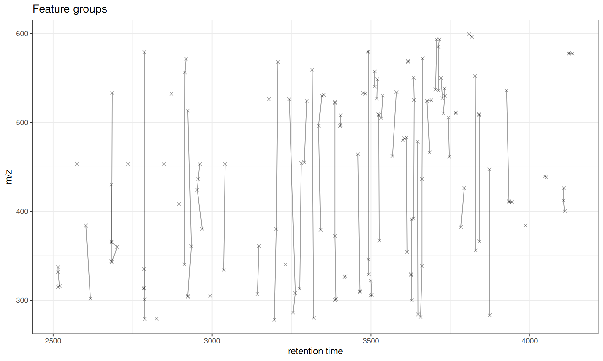
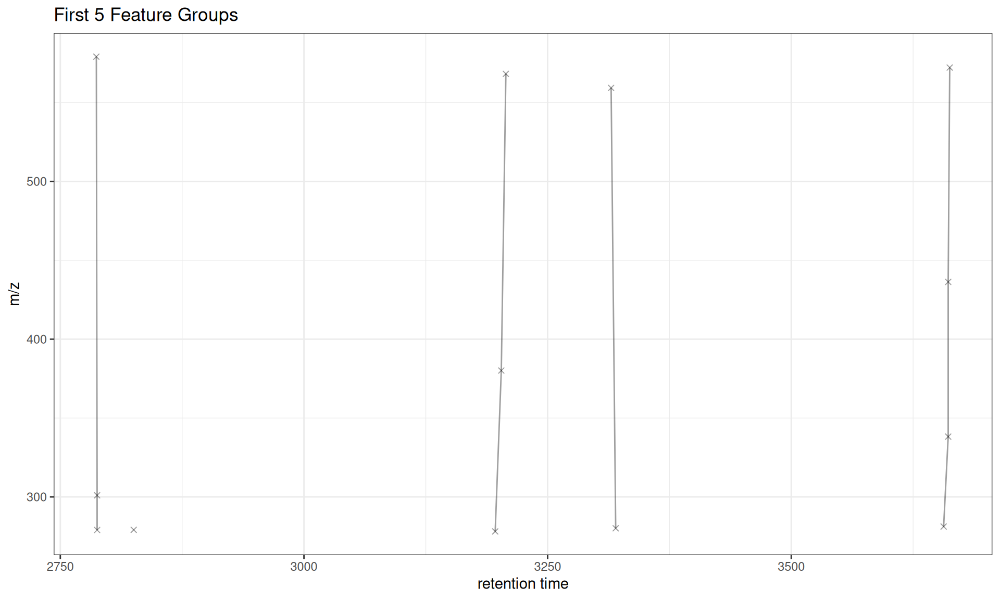
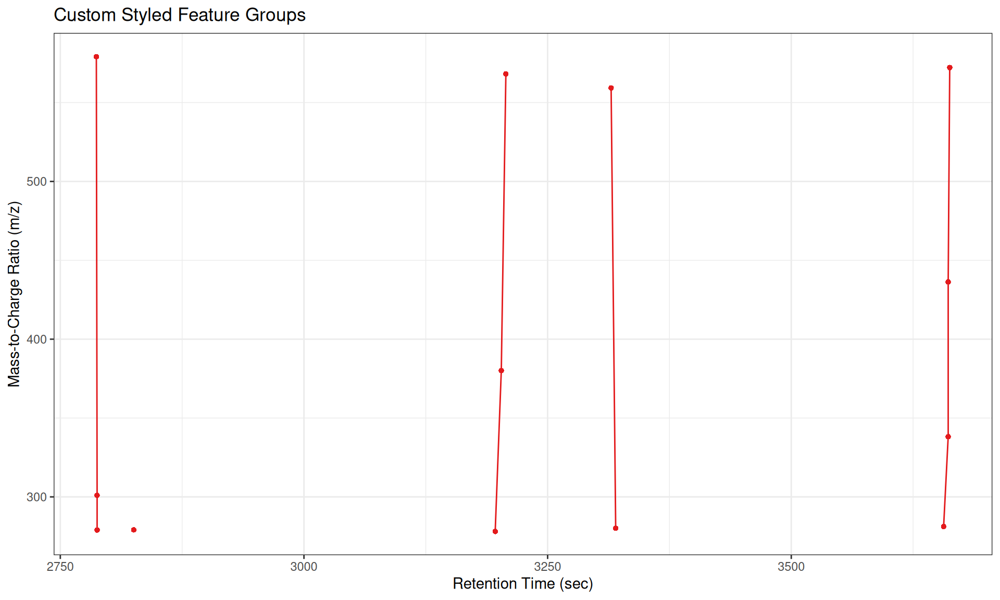
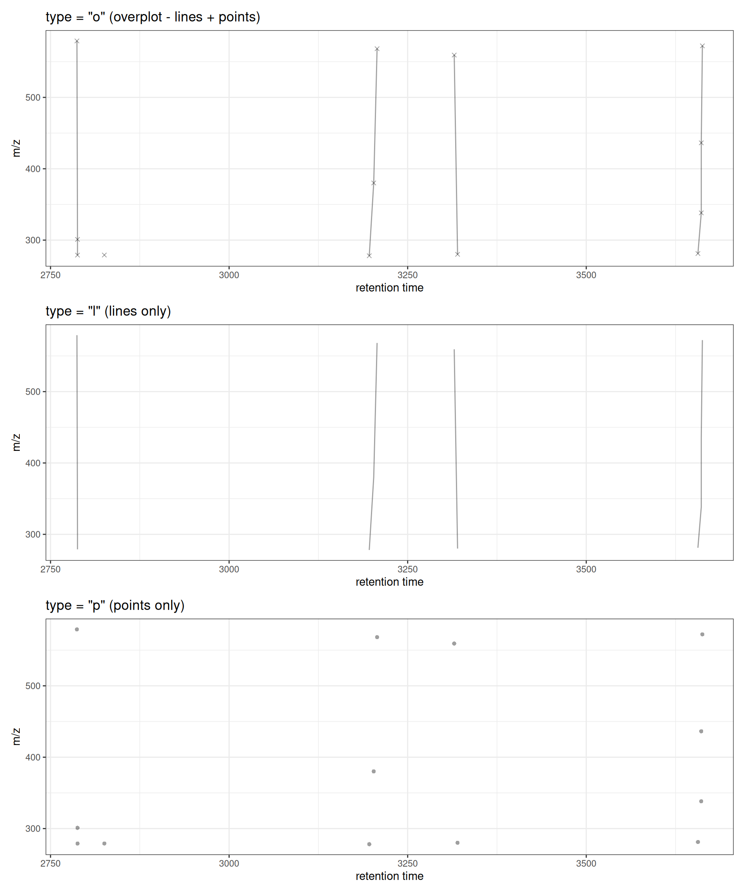
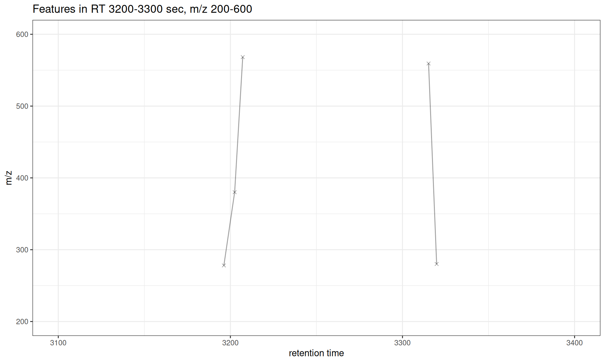
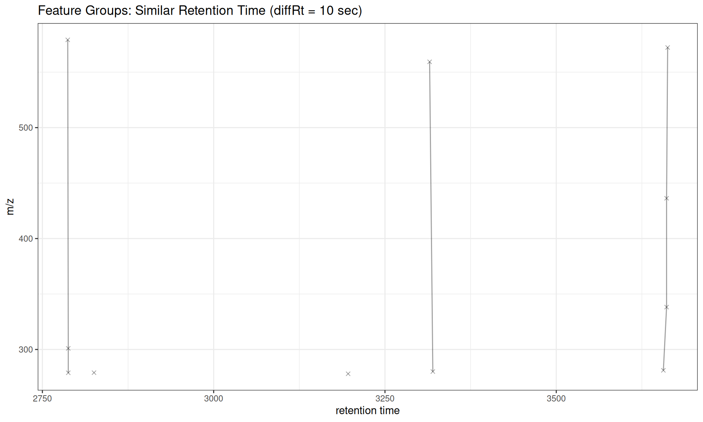
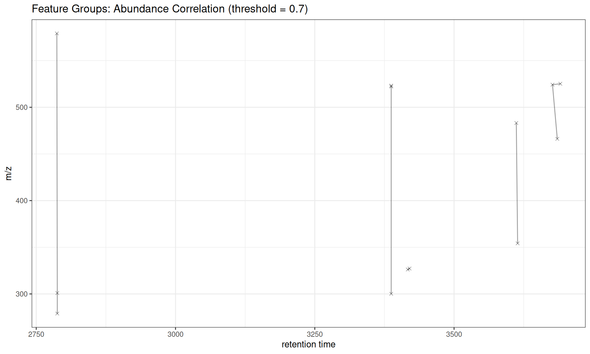

# Step 5: Feature Grouping Visualization

## Introduction

This vignette covers the **final step** in the XCMS metabolomics
workflow: **feature grouping**. After retention time alignment, these
functions help you:

- Visualize relationships between features
- Identify isotopes, adducts, and fragments
- Assess feature annotation quality
- Create publication-ready feature network plots

### XCMS Workflow Context

    ┌───────────────────────────────┐
    │ 1. Raw Data Visualization     │
    │ 2. Peak Detection             │
    │ 3. Peak Correspondence        │
    │ 4. Retention Time Alignment   │
    ├───────────────────────────────┤
    │ 5. FEATURE GROUPING           │ ← YOU ARE HERE
    └───────────────────────────────┘

### What is Feature Grouping?

Feature grouping identifies features that likely represent the same
compound. After feature detection and correspondence,
[`groupFeatures()`](https://rdrr.io/pkg/MsFeatures/man/groupFeatures.html)
connects features that may be:

- **Isotopes**: M+1, M+2 isotopic peaks
- **Adducts**: \[M+H\]+, \[M+Na\]+, \[M+K\]+, etc.
- **Fragments**: In-source fragmentation products
- **Correlated features**: Compounds with similar abundance patterns

The
[`gplotFeatureGroups()`](https://stanstrup.github.io/xcmsVis/reference/gplotFeatureGroups.md)
function visualizes these relationships by plotting features connected
by lines within each group across retention time and m/z dimensions.

### Functions Covered

| Function                                                                                      | Purpose                               | Input                    |
|-----------------------------------------------------------------------------------------------|---------------------------------------|--------------------------|
| [`gplotFeatureGroups()`](https://stanstrup.github.io/xcmsVis/reference/gplotFeatureGroups.md) | Visualize feature group relationships | XcmsExperiment, XCMSnExp |

## Setup

``` r
library(xcms)
library(xcmsVis)
library(MsExperiment)
library(MsFeatures)
library(ggplot2)
library(BiocParallel)
library(patchwork)

# Configure for serial processing
register(SerialParam())
```

## Load and Process Data

Feature grouping requires a complete XCMS workflow: peak detection,
correspondence, retention time alignment, re-correspondence, and then
feature grouping.

We’ll use pre-processed data with peaks already detected:

``` r
# Load pre-processed data with detected peaks
# This dataset contains 248 detected peaks from 3 samples
xdata <- loadXcmsData("faahko_sub2")

# Add sample metadata
sampleData(xdata)$sample_name <- c("KO01", "KO02", "WT01")
sampleData(xdata)$sample_group <- c("KO", "KO", "WT")

cat("Loaded", length(fileNames(xdata)), "files\n")
#> Loaded 3 files
cat("Detected peaks:", nrow(chromPeaks(xdata)), "\n")
#> Detected peaks: 248
```

### Complete XCMS Workflow

``` r
# 1. Peak grouping (correspondence)
pdp <- PeakDensityParam(sampleGroups = sampleData(xdata)$sample_group,
                        minFraction = 0.5, bw = 30)
xdata <- groupChromPeaks(xdata, param = pdp)
cat("Grouped into", nrow(featureDefinitions(xdata)), "features\n")
#> Grouped into 152 features

# 2. Retention time alignment
xdata <- adjustRtime(xdata, param = ObiwarpParam())

# 3. Re-group after alignment
xdata <- groupChromPeaks(xdata, param = pdp)
cat("After alignment:", nrow(featureDefinitions(xdata)), "features\n")
#> After alignment: 152 features

# 4. Group features (identify related features)
xdata <- groupFeatures(xdata, param = SimilarRtimeParam(diffRt = 20))
cat("Identified", length(unique(featureGroups(xdata))), "feature groups\n")
#> Identified 63 feature groups
```

## Basic Feature Group Visualization

The default plot shows all feature groups, with features connected by
lines within each group:

``` r
gplotFeatureGroups(xdata)
```



### Interpretation

- **Points**: Individual features (at their median RT and m/z across
  samples)
- **Lines**: Connect features within the same group
- **Groups**: Represent features likely from the same compound
  (isotopes, adducts, etc.)

## Filtering to Specific Feature Groups

You can visualize specific feature groups of interest:

``` r
# Get all feature group IDs
all_groups <- unique(featureGroups(xdata))
cat("Feature groups:", head(all_groups, 10), "\n")
#> Feature groups: FG.043 FG.012 FG.054 FG.038 FG.019 FG.023 FG.028 FG.048 FG.009 FG.018

# Plot first 5 groups
gplotFeatureGroups(xdata, featureGroups = all_groups[1:5]) +
  ggtitle("First 5 Feature Groups")
```



## Customization

### Custom Styling

``` r
# Get first 5 feature groups for clearer visualization
all_groups <- unique(featureGroups(xdata))

gplotFeatureGroups(xdata,
                   featureGroups = all_groups[1:5],
                   col = "#E31A1C",  # Red color
                   pch = 16) +       # Solid circles
  labs(x = "Retention Time (sec)",
       y = "Mass-to-Charge Ratio (m/z)",
       title = "Custom Styled Feature Groups")
```



### Different Plot Types

The `type` parameter controls whether to show lines, points, or both:

``` r
# Use subset of feature groups for clearer visualization
fg_subset <- all_groups[1:5]

# Plot with lines and points (default)
p1 <- gplotFeatureGroups(xdata, featureGroups = fg_subset, type = "o") +
  ggtitle('type = "o" (overplot - lines + points)')

# Plot with lines only
p2 <- gplotFeatureGroups(xdata, featureGroups = fg_subset, type = "l") +
  ggtitle('type = "l" (lines only)')

# Plot with points only
p3 <- gplotFeatureGroups(xdata, featureGroups = fg_subset, type = "p", pch = 16) +
  ggtitle('type = "p" (points only)')

# Combine plots
p1 / p2 / p3
```



### Zooming to Specific Regions

Use `xlim` and `ylim` to focus on specific retention time or m/z ranges:

``` r
# Focus on features between 3200-3300 seconds RT and specific feature groups
gplotFeatureGroups(xdata,
                   featureGroups = fg_subset,
                   xlim = c(3100, 3400),
                   ylim = c(200, 600)) +
  ggtitle("Features in RT 3200-3300 sec, m/z 200-600")
```



## Interactive Visualization

Convert to interactive plotly plot for exploration:

``` r
library(plotly)

# Use subset for better interactivity
p <- gplotFeatureGroups(xdata, featureGroups = fg_subset)
ggplotly(p)
```

## Understanding Feature Groups

Feature groups represent features that are likely derived from the same
compound. Common grouping parameters:

### Similar Retention Time

``` r
# Group features with similar retention times (likely isotopes/adducts)
xdata_rt <- groupFeatures(xdata, param = SimilarRtimeParam(diffRt = 10))
cat("SimilarRtimeParam (diffRt=10):",
    length(unique(featureGroups(xdata_rt))), "groups\n")
#> SimilarRtimeParam (diffRt=10): 76 groups

# Show first 5 groups
fg_rt <- unique(featureGroups(xdata_rt))
gplotFeatureGroups(xdata_rt, featureGroups = fg_rt[1:5]) +
  ggtitle("Feature Groups: Similar Retention Time (diffRt = 10 sec)")
```



### Abundance Correlation

``` r
# Group features with correlated abundances across samples
xdata_cor <- groupFeatures(xdata, param = AbundanceSimilarityParam(threshold = 0.7))
cat("AbundanceSimilarityParam (threshold=0.7):",
    length(unique(featureGroups(xdata_cor))), "groups\n")
#> AbundanceSimilarityParam (threshold=0.7): 139 groups

# Show some groups with multiple Features
fg_cor <- names(rev(sort(table(featureGroups(xdata_cor)))))
gplotFeatureGroups(xdata_cor, featureGroups = fg_cor[1:5]) +
  ggtitle("Feature Groups: Abundance Correlation (threshold = 0.7)")
```



## Use Cases

### Isotope Pattern Identification

Features grouped by similar RT and abundance correlation may represent
isotope patterns (e.g. M, M+1, M+2) or adducts (e.g. \[M+H\]+,
\[M+Na\]+).

### Adduct Identification

Features with similar RT but different m/z values that correlate in
abundance may be different adducts of the same compound.

### Quality Control

Visualize feature groups to:

- Verify grouping parameters are appropriate
- Identify over-grouping (too many features in one group)
- Identify under-grouping (features that should be grouped but aren’t)

## Summary

### Use Cases

- **Compound annotation**: Identify isotopes, adducts, and fragments
- **Quality control**: Verify feature grouping quality
- **Method development**: Optimize groupFeatures parameters
- **Publication**: Create network plots of feature relationships

### Workflow Complete!

You’ve now completed the full XCMS visualization workflow:

    ✓ 1. Raw Data Visualization
    ✓ 2. Peak Detection
    ✓ 3. Peak Correspondence
    ✓ 4. Retention Time Alignment
    ✓ 5. Feature Grouping

## Comparison with Original XCMS

### Original XCMS Version

``` r
# Get first 5 feature groups for comparison
fg_compare <- unique(featureGroups(xdata))[1:5]

# XCMS original (base R graphics)
plotFeatureGroups(xdata, featureGroups = fg_compare)
```


### xcmsVis ggplot2 Version

``` r
# xcmsVis version (ggplot2)
gplotFeatureGroups(xdata, featureGroups = fg_compare)
```


> **API Differences**
>
> Unlike the original XCMS
> [`plotFeatureGroups()`](https://rdrr.io/pkg/xcms/man/plotFeatureGroups.html),
> the ggplot2 version does not have `xlab`, `ylab`, or `main`
> parameters. Instead, use ggplot2’s
> [`labs()`](https://ggplot2.tidyverse.org/reference/labs.html) function
> to customize labels after plot creation:
>
> ``` r
> # Customize labels with labs()
> fg_subset <- unique(featureGroups(xdata))[1:2]
> gplotFeatureGroups(xdata, featureGroups = fg_subset) +
>   labs(x = "Retention Time (s)", y = "Mass/Charge", title = "My Custom Title")
> ```
>
> This follows ggplot2 conventions and makes the API more consistent
> with the broader ggplot2 ecosystem.

## Session Info

``` r
sessionInfo()
#> R version 4.5.2 (2025-10-31)
#> Platform: x86_64-pc-linux-gnu
#> Running under: Ubuntu 24.04.3 LTS
#> 
#> Matrix products: default
#> BLAS:   /usr/lib/x86_64-linux-gnu/openblas-pthread/libblas.so.3 
#> LAPACK: /usr/lib/x86_64-linux-gnu/openblas-pthread/libopenblasp-r0.3.26.so;  LAPACK version 3.12.0
#> 
#> locale:
#>  [1] LC_CTYPE=C.UTF-8       LC_NUMERIC=C           LC_TIME=C.UTF-8       
#>  [4] LC_COLLATE=C.UTF-8     LC_MONETARY=C.UTF-8    LC_MESSAGES=C.UTF-8   
#>  [7] LC_PAPER=C.UTF-8       LC_NAME=C              LC_ADDRESS=C          
#> [10] LC_TELEPHONE=C         LC_MEASUREMENT=C.UTF-8 LC_IDENTIFICATION=C   
#> 
#> time zone: UTC
#> tzcode source: system (glibc)
#> 
#> attached base packages:
#> [1] stats     graphics  grDevices utils     datasets  methods   base     
#> 
#> other attached packages:
#> [1] plotly_4.12.0       patchwork_1.3.2     ggplot2_4.0.2      
#> [4] MsFeatures_1.18.0   MsExperiment_1.12.0 ProtGenerics_1.42.0
#> [7] xcmsVis_0.99.10     xcms_4.8.0          BiocParallel_1.44.0
#> 
#> loaded via a namespace (and not attached):
#>   [1] DBI_1.3.0                   rlang_1.1.7                
#>   [3] magrittr_2.0.4              clue_0.3-67                
#>   [5] MassSpecWavelet_1.76.0      otel_0.2.0                 
#>   [7] matrixStats_1.5.0           compiler_4.5.2             
#>   [9] vctrs_0.7.1                 reshape2_1.4.5             
#>  [11] stringr_1.6.0               pkgconfig_2.0.3            
#>  [13] MetaboCoreUtils_1.18.1      crayon_1.5.3               
#>  [15] fastmap_1.2.0               XVector_0.50.0             
#>  [17] labeling_0.4.3              rmarkdown_2.30             
#>  [19] preprocessCore_1.72.0       purrr_1.2.1                
#>  [21] xfun_0.56                   MultiAssayExperiment_1.36.1
#>  [23] jsonlite_2.0.0              progress_1.2.3             
#>  [25] DelayedArray_0.36.0         parallel_4.5.2             
#>  [27] prettyunits_1.2.0           cluster_2.1.8.1            
#>  [29] R6_2.6.1                    stringi_1.8.7              
#>  [31] RColorBrewer_1.1-3          limma_3.66.0               
#>  [33] GenomicRanges_1.62.1        Rcpp_1.1.1                 
#>  [35] Seqinfo_1.0.0               SummarizedExperiment_1.40.0
#>  [37] iterators_1.0.14            knitr_1.51                 
#>  [39] IRanges_2.44.0              BiocBaseUtils_1.12.0       
#>  [41] Matrix_1.7-4                igraph_2.2.2               
#>  [43] tidyselect_1.2.1            abind_1.4-8                
#>  [45] yaml_2.3.12                 doParallel_1.0.17          
#>  [47] codetools_0.2-20            affy_1.88.0                
#>  [49] lattice_0.22-7              tibble_3.3.1               
#>  [51] plyr_1.8.9                  withr_3.0.2                
#>  [53] Biobase_2.70.0              S7_0.2.1                   
#>  [55] evaluate_1.0.5              Spectra_1.20.1             
#>  [57] pillar_1.11.1               affyio_1.80.0              
#>  [59] BiocManager_1.30.27         MatrixGenerics_1.22.0      
#>  [61] foreach_1.5.2               stats4_4.5.2               
#>  [63] MSnbase_2.36.0              MALDIquant_1.22.3          
#>  [65] ncdf4_1.24                  generics_0.1.4             
#>  [67] S4Vectors_0.48.0            hms_1.1.4                  
#>  [69] scales_1.4.0                glue_1.8.0                 
#>  [71] lazyeval_0.2.2              tools_4.5.2                
#>  [73] mzID_1.48.0                 data.table_1.18.2.1        
#>  [75] QFeatures_1.20.0            vsn_3.78.1                 
#>  [77] mzR_2.44.0                  fs_1.6.7                   
#>  [79] XML_3.99-0.22               grid_4.5.2                 
#>  [81] impute_1.84.0               tidyr_1.3.2                
#>  [83] crosstalk_1.2.2             MsCoreUtils_1.22.1         
#>  [85] PSMatch_1.14.0              cli_3.6.5                  
#>  [87] viridisLite_0.4.3           S4Arrays_1.10.1            
#>  [89] dplyr_1.2.0                 AnnotationFilter_1.34.0    
#>  [91] pcaMethods_2.2.0            gtable_0.3.6               
#>  [93] digest_0.6.39               BiocGenerics_0.56.0        
#>  [95] SparseArray_1.10.9          htmlwidgets_1.6.4          
#>  [97] farver_2.1.2                htmltools_0.5.9            
#>  [99] lifecycle_1.0.5             httr_1.4.8                 
#> [101] statmod_1.5.1               MASS_7.3-65
```
